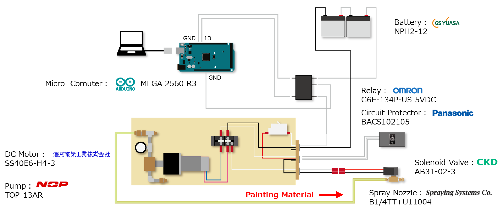
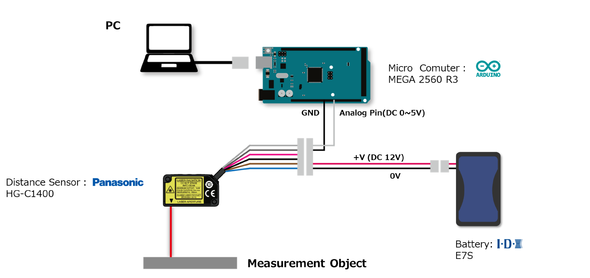

# This page is tutoreal for ROS-based Arduino program

## Connect your PC & Arduino devices
## パソコンとArduino（とその他機器）を図のように繋いでください

To Controll Pump & Solenoid Nozzle

To Controll Laser Distance Sensor



## Getting started
## 始めるにあたって…
First of all please download & install Arduino IDE from official page.
    https://www.arduino.cc/en/software   
Then, you can edit .ino files.
公式サイトからArduino IDEをダウンロードしてください．
.inoファイルを簡単に編集・Aruinoに書き込みできるようになります．
まずは上の2つのファイルもダウンロードしてみましょう．

ファイルの書き込み方は調べてください（追記予定）

## Run the code as ros node on Linux PC
## ROSのノードとしてArduinoを動かすには

1台目：ポンプ・電磁弁の動作
```
cd <your workspace>
(source devel/setup.bash)
rosrun rosserial_python serial_node.py _port:=/dev/ttyACM0
```

## 2nd Device
## 2台目: 測距センサ
```
rosrun rosserial_python serial_node.py _port:=/dev/ttyACM1 __ns:=/laser
```
You can check Distance data by typing like 
namespace変更でノードの重複を防ぎつつ起動
rostopic(/laser/laser_d3 : "std_msgs/Float32")でpublishされるはずです．
```
rostopic echo /laser/laser_d3
```

## Something Wrong?
動作がおかしかったら…
Please be careful with port and namespace
Default Seeting is "/dev/ttyUSB0" or something like this.
And ROS can't run same node(different name is acceptable). Change namespace when you run 2 or more same package, node.

Arduinoに割り振られたポート名を確認しましょう．デフォルトだと"/dev/ttyUSB0"とかそんな感じだったはず．
ポートが変わっているようであれば
```
ls /dev/ttyACM*
```
とかでポートを確かめましょう．
また，同時に同じノードは立てられないのでnamespaceを変えたりすることで，Arduioを2台以上同時にROSで動かせます．
